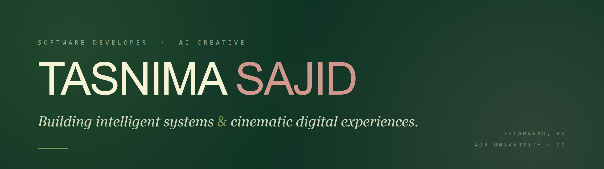

 

I'm **Tasnima Sajid** — a Computer Science student at Air University who builds **software systems** and directs **cinematic AI content**. Equally at home in a socket buffer and a colour grade: I ship full-stack platforms, systems-level tools, and cross-platform apps, and I craft AI-generated video and brand experiences on the side.

- 🧩 Currently a **Web Development Intern** at Merik Solutions
- 🎓 **BS Computer Science**, Air University (Islamabad) — expected 2028
- 🌱 Deepening **Blazor / .NET**, distributed systems, and AI-native product design
- 🎬 Also a **content creator** — generative video, prompt design, art direction

---

### 🛠️ Tech Stack

**Languages**

**Frameworks & Tools**

**Design & Creative**

---

### 🚀 Featured Projects

| Project | What it is | Stack | Links |
|---|---|---|---|
| **LOOM** | Visual programming platform — build node graphs, compile to real C# | `C#` `.NET` `Blazor` | [Live](https://loom.runasp.net/) · [Repo](https://github.com/Loom-Dev-2026/LOOM) |
| **PromptQ** | AI-native mobile app for prompt workflows & management | `Flutter` `Firebase` | [Repo](https://github.com/TasnimaSajid/PromptQ) |
| **LoadForge** | Multi-threaded TCP load balancer, built from raw sockets | `C` `Systems` | [Repo](https://github.com/TasnimaSajid/LoadForge) |
| **Hydra** | Information-security toolkit — cryptography & hardening | `C++` | [Repo](https://github.com/TasnimaSajid/Hydra) |
| **DROS** | Disaster Response Optimization System | `Algorithms` | [Repo](https://github.com/TasnimaSajid/DROS) |
| **Art Gallery MS** | Relational database system for gallery operations | `SQL Server` | [Repo](https://github.com/TasnimaSajid/Art-Gallery-Management-System) |

---

### 📊 GitHub Activity

---

### 🤝 Connect

Islamabad, Pakistan · Developer & AI Creative
